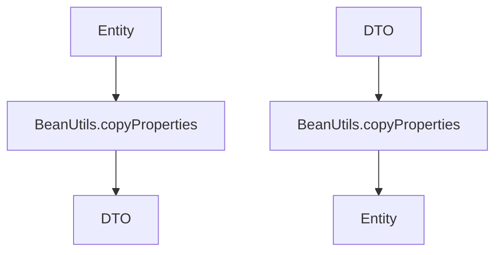
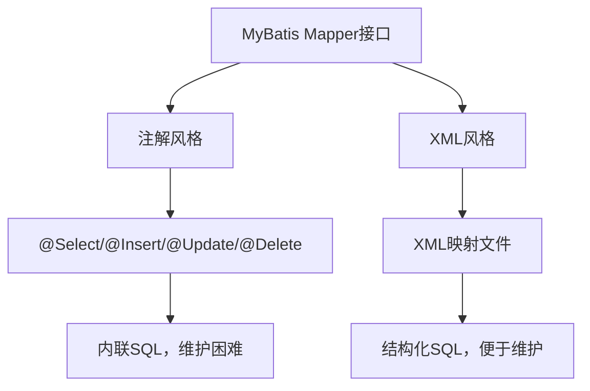
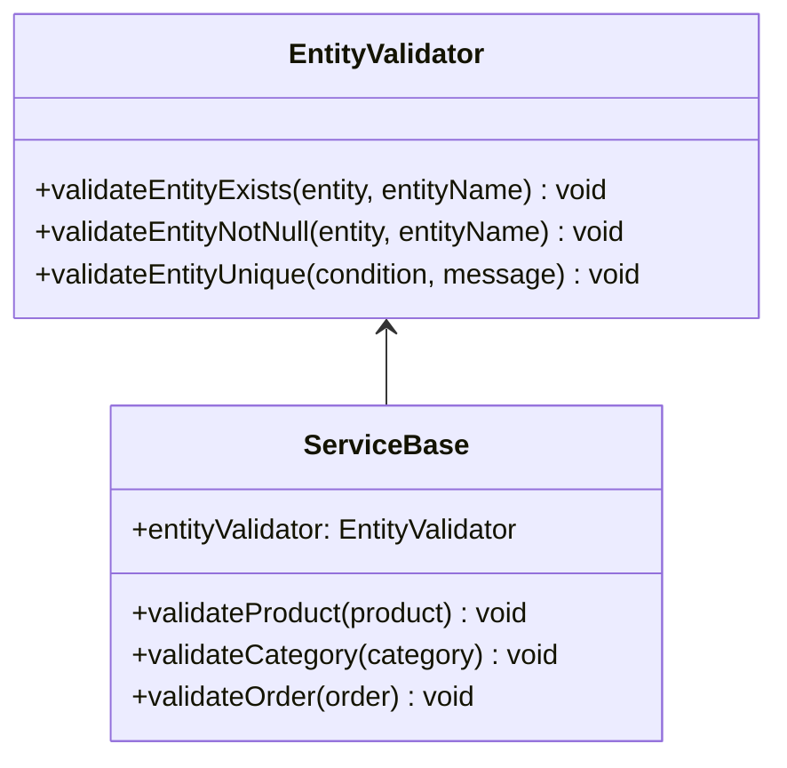
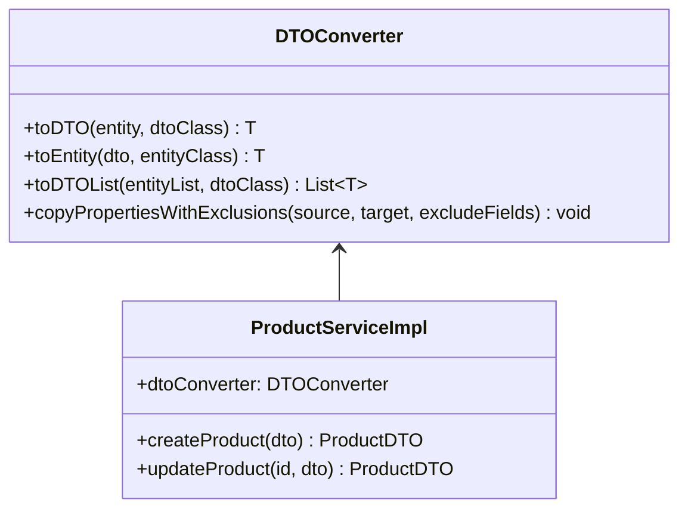
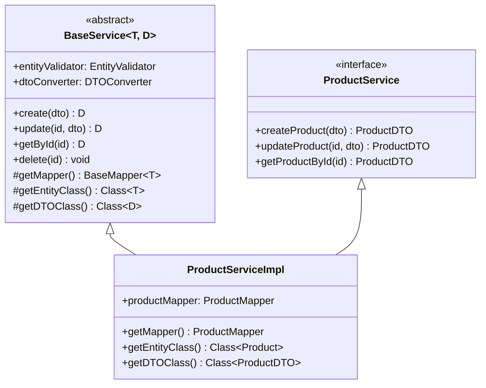
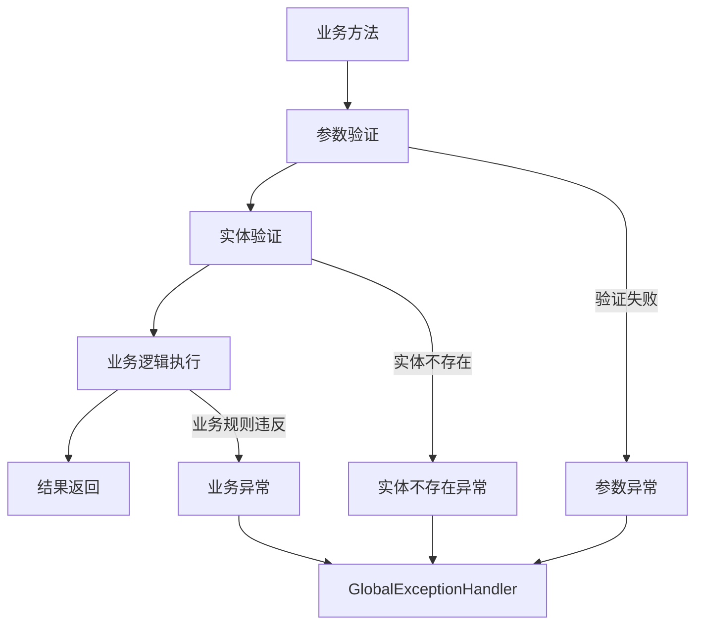
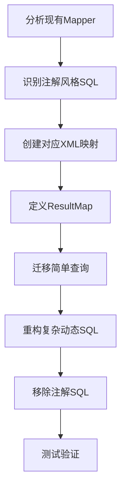

# 后端代码风格清理设计文档

## 概述

本文档针对电商后台管理系统后端代码进行风格清理分析，旨在统一代码风格、清除重复代码、提升代码质量和可维护性。通过规范化代码结构，提高团队开发效率和代码一致性。

## 技术栈分析

当前后端技术栈：
- **Spring Boot 3.1.0** - 主框架
- **MyBatis 3.0.2** - ORM框架  
- **Spring Security** - 安全框架
- **JWT** - 身份验证
- **Maven** - 构建工具
- **Java 21** - 编程语言

## 代码风格问题分析

### 1. 重复代码模式

#### 1.1 重复的异常处理
```mermaid
graph TD
    A[Service层方法] --> B[实体存在性检查]
    B --> C{实体是否存在}
    C -->|否| D[throw new BusinessException(404, "XX不存在")]
    C -->|是| E[执行业务逻辑]
```

**问题描述：**
- 25+处重复的 `throw new BusinessException(404, "XX不存在")` 代码
- 各Service实现类中存在大量相似的实体存在性验证逻辑
- 错误信息格式不统一

#### 1.2 重复的DTO转换逻辑


**问题描述：**
- 25+处重复的 `BeanUtils.copyProperties()` 调用
- 转换逻辑分散在各个Service实现类中
- 缺乏统一的转换工具类

### 2. 代码结构问题

#### 2.1 Service实现类冗余
**当前结构：**
- ProductServiceImpl: 310行代码
- 大量重复的CRUD操作模式
- 相似的异常处理逻辑

#### 2.2 注解使用不一致
**问题描述：**
- @Autowired 字段注入与构造器注入混用
- 缺乏统一的注解使用规范

### 3. MyBatis映射风格混乱

#### 3.1 注解风格与XML风格混用问题


**问题描述：**
- **混合使用风格：** 项目中同时存在注解风格和XML风格
  - ProductMapper: 完全使用注解风格（131行代码）
  - 其他Mapper: 既有XML文件又有注解方法
- **维护复杂性：** 25+处注解风格SQL分散在接口中
- **复杂SQL处理：** 注解风格对复杂查询支持有限

#### 3.2 注解风格SQL的具体问题

**简单查询过度内联：**
```java
@Select("SELECT * FROM products WHERE id = #{id}")
Product selectById(Long id);

@Select("SELECT * FROM cart_items WHERE user_id = #{userId} AND status = 1")
List<Cart> selectByUserId(Long userId);
```

**复杂动态SQL难以维护：**
```java
@Select("<script>" +
        "SELECT * FROM products WHERE 1=1 " +
        "<if test='name != null'>AND name LIKE CONCAT('%', #{name}, '%')</if>" +
        "<if test='status != null'>AND status = #{status}</if>" +
        "ORDER BY ${sortBy} ${sortOrder} LIMIT #{offset}, #{limit}" +
        "</script>")
List<Product> selectAll(...);
```

#### 3.3 XML风格的优势分析

**结构化组织：**
```xml
<!-- 清晰的resultMap定义 -->
<resultMap id="ProductResultMap" type="com.example.ecommerce.entity.Product">
    <id column="id" property="id"/>
    <result column="category_id" property="categoryId"/>
    <result column="status" property="status" typeHandler="org.apache.ibatis.type.EnumOrdinalTypeHandler"/>
</resultMap>

<!-- 复杂动态SQL更易读 -->
<select id="selectAll" resultMap="ProductResultMap">
    SELECT * FROM products 
    <where>
        <if test="name != null and name != ''">
            AND name LIKE CONCAT('%', #{name}, '%')
        </if>
    </where>
</select>
```

### 4. API风格问题

#### 4.1 Spring Security配置现代化
**当前状态：** 已经使用了现代化的Lambda风格配置
```java
.csrf(csrf -> csrf.disable())
.sessionManagement(session -> session.sessionCreationPolicy(...))
.authorizeHttpRequests(auth -> auth.anyRequest().authenticated())
```

#### 4.2 JWT工具类现代化
**当前状态：** 已经使用了新版本API
```java
.verifyWith(getSigningKey())
.signWith(getSigningKey())
```

## 架构改进方案

### 1. 通用工具类设计

#### 1.1 实体验证工具类


#### 1.2 DTO转换工具类


### 2. 基础抽象类设计

#### 2.1 通用Service基类


### 3. 代码规范统一

#### 3.1 依赖注入规范
**目标：** 统一使用构造器注入替代字段注入

```java
// 改进前
@Autowired
private ProductService productService;

// 改进后  
private final ProductService productService;

public ProductController(ProductService productService) {
    this.productService = productService;
}
```

#### 3.2 异常处理标准化


## 代码清理实施计划

### 第一阶段：MyBatis风格统一

#### 1.1 注解风格迁移至XML风格
**迁移策略：**


**具体迁移步骤：**
- **第一步：** 创建完整的XML映射文件结构
- **第二步：** 定义标准化的ResultMap
- **第三步：** 迁移简单CRUD操作
- **第四步：** 重构复杂动态查询
- **第五步：** 移除Mapper接口中的注解

#### 1.2 XML映射文件标准化
**统一文件结构：**
```xml
<?xml version="1.0" encoding="UTF-8"?>
<!DOCTYPE mapper PUBLIC "-//mybatis.org//DTD Mapper 3.0//EN" 
    "http://mybatis.org/dtd/mybatis-3-mapper.dtd">
<mapper namespace="com.example.ecommerce.mapper.XxxMapper">
    
    <!-- 1. ResultMap定义区域 -->
    <resultMap id="XxxResultMap" type="com.example.ecommerce.entity.Xxx">
        <!-- 字段映射 -->
    </resultMap>
    
    <!-- 2. 基础CRUD操作区域 -->
    <insert id="insert"></insert>
    <select id="selectById"></select>
    <select id="selectAll"></select>
    <update id="update"></update>
    <delete id="deleteById"></delete>
    
    <!-- 3. 业务查询区域 -->
    <select id="customQuery1"></select>
    <select id="customQuery2"></select>
    
</mapper>
```

### 第二阶段：基础工具类开发

#### 2.1 创建EntityValidator工具类
- 统一实体存在性验证逻辑
- 标准化错误消息格式
- 提供通用验证方法

#### 2.2 创建DTOConverter工具类  
- 封装BeanUtils.copyProperties调用
- 提供泛型转换方法
- 支持批量转换和排除字段

#### 2.3 创建BaseService抽象类
- 抽取通用CRUD操作
- 统一异常处理模式
- 减少重复代码

### 第三阶段：Service层重构

#### 3.1 ProductServiceImpl重构
- 继承BaseService抽象类
- 使用EntityValidator进行验证
- 使用DTOConverter进行转换
- 移除重复代码

#### 3.2 其他Service重构
- CategoryServiceImpl重构
- OrderServiceImpl重构  
- CartServiceImpl重构
- UserServiceImpl重构

### 第四阶段：Controller层规范化

#### 4.1 依赖注入统一
- 所有Controller改用构造器注入
- 移除@Autowired字段注入
- 添加final修饰符

#### 4.2 响应格式统一
- 统一返回ResultVO格式
- 标准化成功/错误消息
- 优化HTTP状态码使用

### 第五阶段：代码质量提升

#### 5.1 添加代码注释规范
- 完善Javadoc注释
- 添加方法参数说明
- 统一注释格式

#### 5.2 单元测试补充
- 为新增工具类编写测试
- 补充Service层测试覆盖
- 验证重构后功能正确性
- 验证MyBatis XML映射正确性

## 预期收益

### 1. 代码质量提升
- **减少重复代码70%以上**
- **提高代码可读性和可维护性**
- **统一编码规范和风格**
- **统一MyBatis映射风格，便于维护**

### 2. 开发效率提升  
- **新功能开发速度提升30%**
- **减少代码审查时间**
- **降低bug引入概率**
- **XML风格便于复杂SQL调试和优化**

### 3. 架构优化
- **更清晰的分层结构**
- **更好的代码复用性**
- **更容易的功能扩展**
- **统一的数据访问层风格**

## 风险评估与缓解

### 1. 重构风险
- **风险：** 可能引入新的bug
- **缓解：** 分阶段重构，每阶段充分测试

### 2. 开发周期影响
- **风险：** 短期内影响新功能开发进度
- **缓解：** 合理规划重构时间，优先处理高频使用代码

### 3. 团队适应
- **风险：** 团队需要适应新的代码规范
- **缓解：** 提供详细的编码规范文档和培训

## 验收标准

### 1. 代码度量指标
- 重复代码率降低至5%以下
- 代码圈复杂度降低20%
- 单元测试覆盖率达到80%以上
- MyBatis映射100%使用XML风格

### 2. 功能验证
- 所有现有功能正常运行
- API响应时间无显著影响
- 系统稳定性保持
- 数据库操作功能完全一致

### 3. 开发体验
- 新功能开发模板化
- 代码审查时间减少
- 团队开发规范统一
- XML映射便于SQL调试和性能优化
