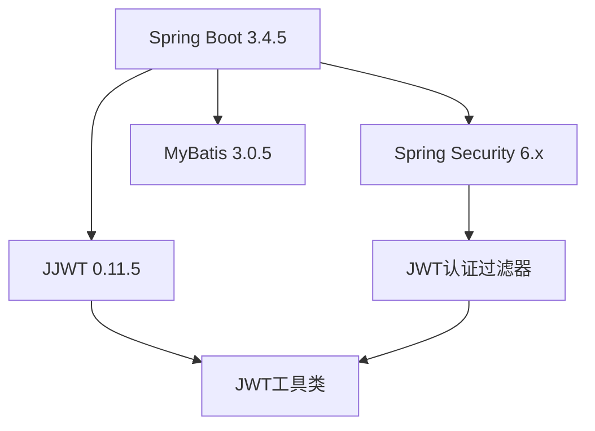
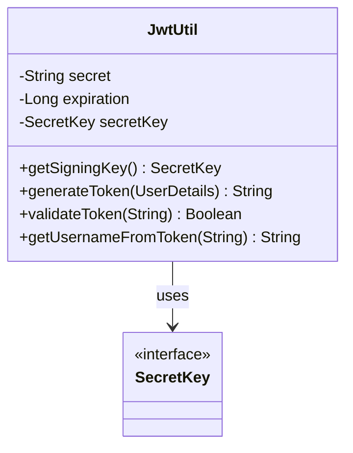
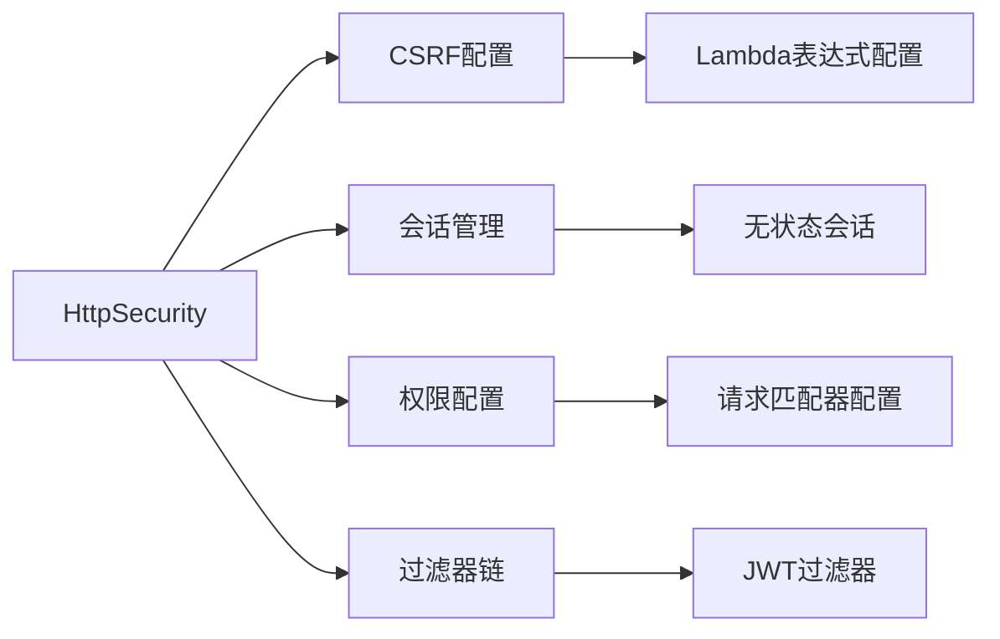
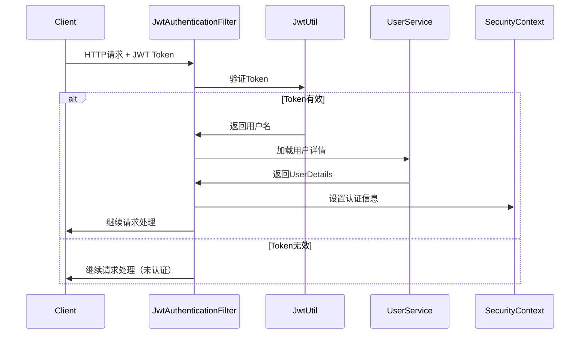

# JWT Spring Boot Security 修复设计文档

## 1. 问题概述

### 1.1 核心问题
电商后台管理系统中的JWT Spring Boot Security无法正常执行，主要涉及版本兼容性和API弃用问题。

### 1.2 影响范围
- JWT令牌生成和验证功能失效
- 用户身份认证无法正常工作
- API接口权限控制失效
- 用户登录和注册功能受影响

### 1.3 问题分类
- **依赖版本冲突**：Spring Boot 3.4.5与JWT 0.11.5版本不兼容
- **API弃用问题**：使用了过时的JJWT API方法
- **Security配置过时**：使用了Spring Security 6.x中已弃用的配置方式

## 2. 技术分析

### 2.1 当前技术栈


### 2.2 兼容性问题分析

#### 2.2.1 JJWT API变更
| 过时方法 | 新方法 | 影响组件 |
|---------|--------|----------|
| `Jwts.parser().setSigningKey()` | `Jwts.parser().verifyWith()` | JwtUtil.getAllClaimsFromToken() |
| `signWith(SignatureAlgorithm, String)` | `signWith(Key)` | JwtUtil.doGenerateToken() |
| `setSigningKey(String)` | `verifyWith(Key)` | JWT解析过程 |

#### 2.2.2 Spring Security配置变更
| 过时配置 | 新配置 | 影响范围 |
|---------|--------|----------|
| `.csrf().disable()` | `.csrf(csrf -> csrf.disable())` | SecurityConfig |
| `.sessionManagement().sessionCreationPolicy()` | `.sessionManagement(session -> ...)` | 会话管理 |
| `.authorizeHttpRequests()` | `.authorizeHttpRequests(auth -> ...)` | 权限配置 |

### 2.3 密钥管理问题
当前使用String类型密钥，需要转换为SecretKey类型以符合JJWT新版本要求。

## 3. 解决方案设计

### 3.1 依赖版本升级策略

#### 3.1.1 保持当前版本方案（推荐）
```xml
<!-- 保持Spring Boot 3.4.5，升级JJWT到最新兼容版本 -->
<jwt.version>0.12.5</jwt.version>
<mybatis.version>3.0.5</mybatis.version>
```

#### 3.1.2 版本回退方案（备选）
```xml
<!-- 回退到稳定版本组合 -->
<parent>
    <groupId>org.springframework.boot</groupId>
    <artifactId>spring-boot-starter-parent</artifactId>
    <version>3.1.0</version>
</parent>
<jwt.version>0.11.5</jwt.version>
```

### 3.2 JWT工具类重构设计

#### 3.2.1 密钥管理重构


#### 3.2.2 API方法映射
| 原方法 | 新实现 | 变更说明 |
|-------|--------|----------|
| `getAllClaimsFromToken()` | 使用`verifyWith(secretKey)` | 密钥验证方式变更 |
| `doGenerateToken()` | 使用`signWith(secretKey)` | 签名方式变更 |
| 字符串密钥 | SecretKey对象 | 类型安全改进 |

### 3.3 Security配置现代化

#### 3.3.1 配置方法重构


#### 3.3.2 权限配置优化
| 路径模式 | 权限要求 | 配置方式 |
|---------|----------|----------|
| `/api/auth/**` | 允许所有 | `permitAll()` |
| `/swagger-ui/**` | 允许所有 | `permitAll()` |
| `/actuator/**` | 认证要求 | `authenticated()` |
| 其他API | 认证要求 | `authenticated()` |

### 3.4 过滤器链优化

#### 3.4.1 认证流程设计


## 4. 实现计划

### 4.1 修复优先级
1. **高优先级**：JWT工具类API适配
2. **高优先级**：Security配置现代化
3. **中优先级**：过滤器异常处理增强
4. **低优先级**：性能优化和缓存机制

### 4.2 分阶段实施

#### 阶段1：依赖版本调整
- 升级JJWT到0.12.5版本
- 验证所有依赖兼容性
- 更新Maven配置

#### 阶段2：核心代码重构
- 重构JwtUtil类
- 更新SecurityConfig配置
- 修复JwtAuthenticationFilter

#### 阶段3：测试验证
- 单元测试验证
- 集成测试验证
- 安全性测试

### 4.3 回滚策略
如果升级过程中出现不可预见的问题：
1. 立即回退到Spring Boot 3.1.0版本
2. 使用JJWT 0.11.5兼容代码
3. 保持原有Security配置结构

## 5. 风险评估与缓解

### 5.1 技术风险
| 风险类型 | 影响程度 | 缓解措施 |
|---------|----------|----------|
| API不兼容 | 高 | 充分测试，准备回滚方案 |
| 性能下降 | 中 | 性能基准测试，优化配置 |
| 安全漏洞 | 高 | 安全审计，最新版本跟踪 |

### 5.2 业务风险
- **用户登录中断**：通过灰度发布降低影响
- **数据安全风险**：加强密钥管理和存储安全
- **服务可用性**：准备快速回滚机制

## 6. 测试策略

### 6.1 单元测试覆盖
- JWT生成和验证功能
- 用户认证流程
- 权限校验逻辑
- 异常处理机制

### 6.2 集成测试场景
- 用户登录注册流程
- API权限控制验证
- Token过期处理
- 多用户并发访问

### 6.3 安全测试要点
- JWT Token伪造防护
- 密钥泄露风险评估
- 会话管理安全性
- CORS和CSRF防护